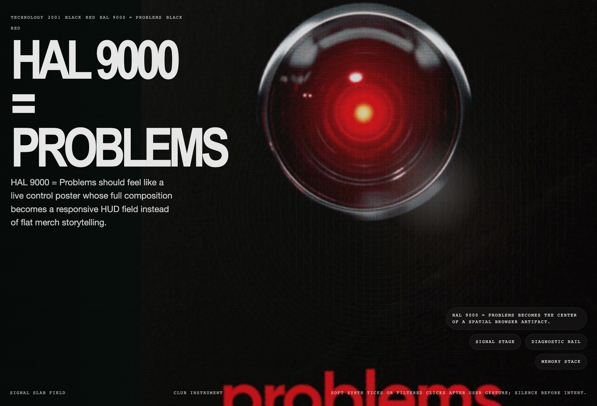
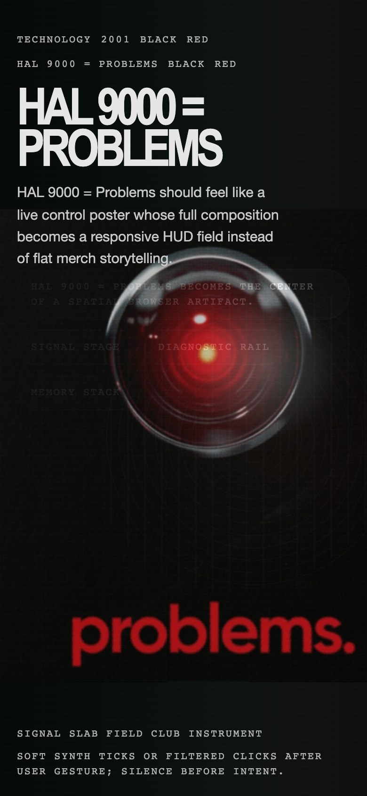

# HAL 9000 = Problems Inspired Design System

[DESIGN.md](./DESIGN.md) derived from the Arte Collective poster [HAL 9000 = Problems](https://arte-collective.com/collections/technology/products/hal-9000-problems). This entry intentionally ignores the storefront chrome and instead translates the poster artwork into an imagined interactive website system with web/mobile guidance, spatial mechanics, motion rules, and any variant transpositions baked into `meta.json`.

## Files

| File | Description |
|------|-------------|
| DESIGN.md | Full design-system reference with web/mobile guidance plus mechanics and implementation notes |
| preview.html | Light preview page generated from the extracted tokens |
| preview-dark.html | Dark preview page generated from the extracted tokens |
| meta.json | Source metadata, capture checklist, extracted tokens, inferred mechanics, and implementation prompt |
| screenshots/desktop.jpg | Concept desktop render |
| screenshots/mobile.jpg | Concept mobile render |

## Mechanics Snapshot

- World systems: Club Instrument, Playable Poster
- Archetype: Club Instrument
- Inputs: hover, tap, drag, scroll
- Mobile fallback: Collapse to one active hero slab, two stacked telemetry rails, and tap-to-cycle data states instead of precision hover behavior.

## Source Notes

- Tags: poster-derived, 3d-space, typography, animation, graphic-design, retro, playful, sound-design, culture-tech, arte-technology
- Credits: Arte Collective
- Added to loadmo.re: Arte Collective poster ingestion
- Capture status: concept-derived
- Capture mode: concept-derived
- Archival fallback: no
- Poster collections: Technology
- Poster crop asset: assets/poster-crop.jpg

## Preview

### Web

### Mobile

