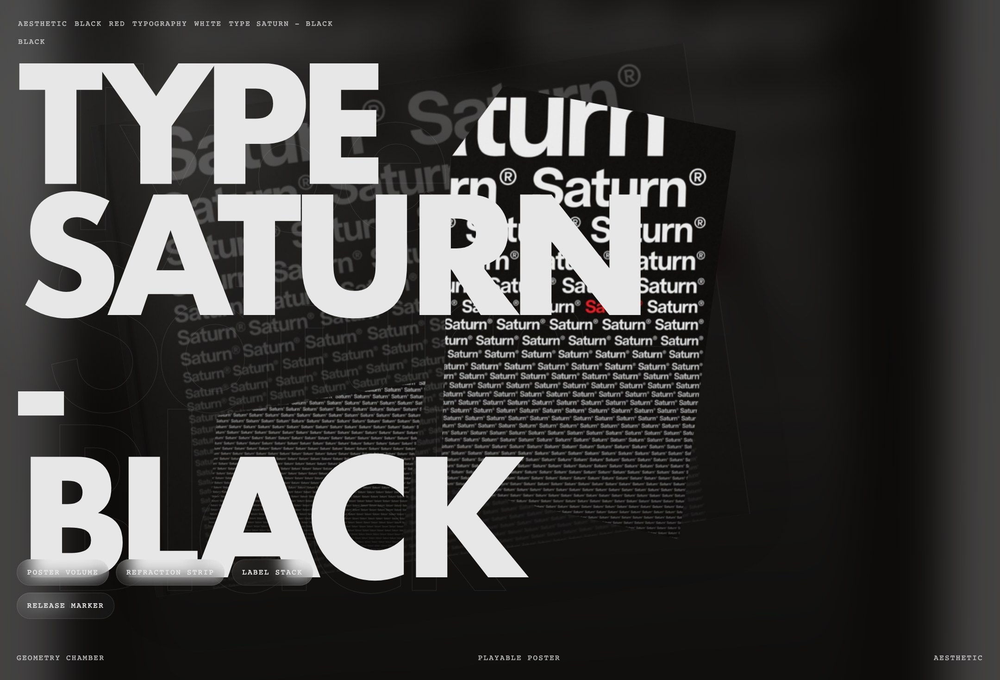
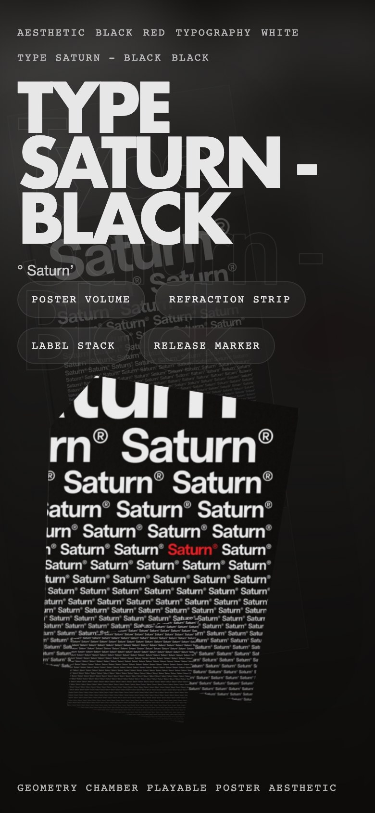

# Type Saturn - Black Inspired Design System

[DESIGN.md](./DESIGN.md) derived from the Arte Collective poster [Type Saturn - Black](https://arte-collective.com/collections/aesthetic/products/saturn-type-black). This entry intentionally ignores the storefront chrome and instead translates the poster artwork into an imagined interactive website system with web/mobile guidance, spatial mechanics, and motion rules.

## Files

| File | Description |
|------|-------------|
| DESIGN.md | Full design-system reference with web/mobile guidance plus mechanics and implementation notes |
| preview.html | Light preview page generated from the extracted tokens |
| preview-dark.html | Dark preview page generated from the extracted tokens |
| meta.json | Source metadata, capture checklist, extracted tokens, inferred mechanics, and implementation prompt |
| screenshots/desktop.jpg | Concept desktop render |
| screenshots/mobile.jpg | Concept mobile render |

## Mechanics Snapshot

- World systems: Playable Poster, Luxury Archive
- Archetype: Playable Poster
- Inputs: hover, drag, scroll, tap
- Mobile fallback: Split the chamber into stacked scenes with one tilt response and one caption rail instead of maintaining full desktop depth.

## Source Notes

- Tags: poster-derived, 3d-space, typography, animation, graphic-design, colorful, arte-aesthetic
- Credits: Arte Collective
- Added to loadmo.re: Arte Collective poster ingestion
- Capture status: concept-derived
- Capture mode: concept-derived
- Archival fallback: no
- Poster collections: Aesthetic
- Poster crop asset: assets/poster-crop.jpg

## Preview

### Web

### Mobile

