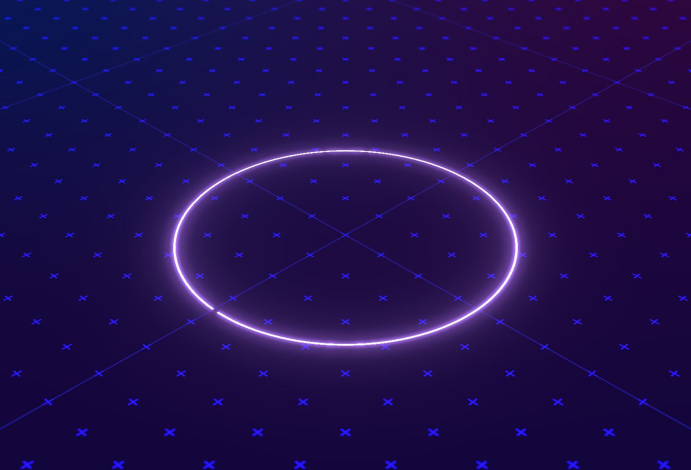
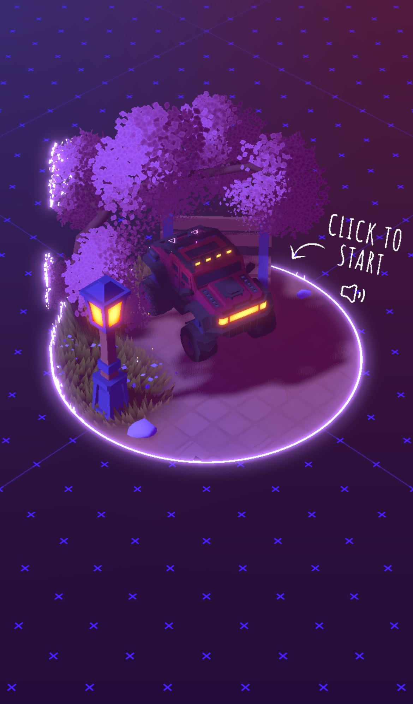

# Bruno Simon Inspired Design System

[DESIGN.md](./DESIGN.md) extracted from the public [Bruno Simon](https://bruno-simon.com/) website, cross-referenced with [manual curation](https://bruno-simon.com/). This is not the official design system. The goal is to give an AI agent enough grounded design language to recreate the feel without flattening it into generic SaaS UI.

## Files

| File | Description |
|------|-------------|
| DESIGN.md | Full design-system reference with separate web/mobile guidance |
| preview.html | Light preview page generated from the extracted tokens |
| preview-dark.html | Dark preview page generated from the extracted tokens |
| meta.json | Source metadata, capture checklist, extracted tokens |
| screenshots/desktop.jpg | Live or archival desktop viewport capture |
| screenshots/mobile.jpg | Live or archival mobile viewport capture |

## Source Notes

- Tags: 3d-space, playful, portfolio
- Credits: Bruno Simon
- Added to loadmo.re: Manual seed
- Capture status: ok
- Archival fallback: no

## Preview

### Web

### Mobile

