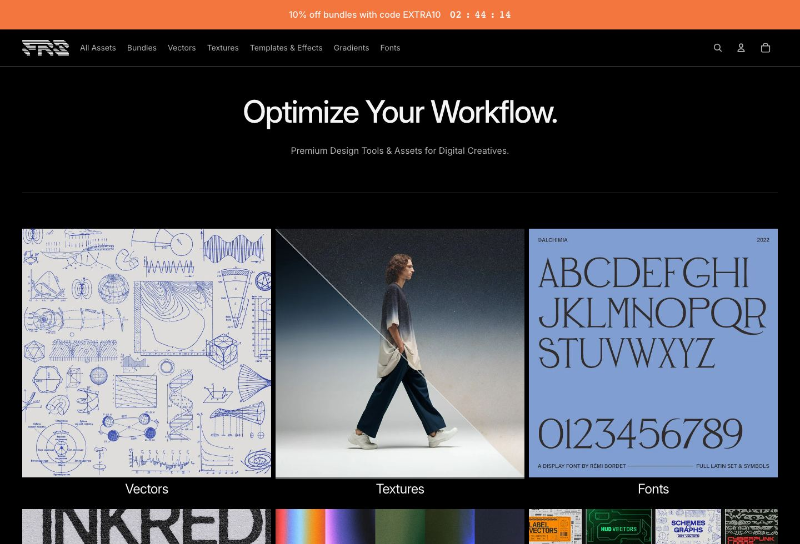
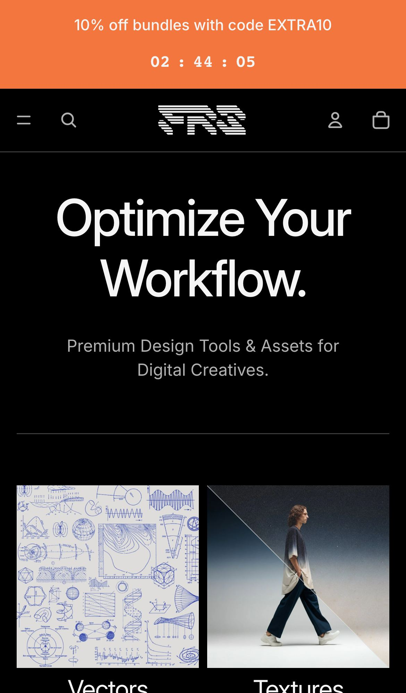

# Fox Rockett Studio Inspired Design System

[DESIGN.md](./DESIGN.md) extracted from the public [Fox Rockett Studio](https://foxrockettstudio.com/) website, cross-referenced with [manual curation](https://foxrockettstudio.com/). This is not the official design system. The goal is to give an AI agent enough grounded design language to recreate the feel without flattening it into generic SaaS UI.

## Files

| File | Description |
|------|-------------|
| DESIGN.md | Full design-system reference with web/mobile guidance plus mechanics and implementation notes |
| preview.html | Light preview page generated from the extracted tokens |
| preview-dark.html | Dark preview page generated from the extracted tokens |
| meta.json | Source metadata, capture checklist, extracted tokens, inferred mechanics, and implementation prompt |
| screenshots/desktop.jpg | Live or archival desktop viewport capture |
| screenshots/mobile.jpg | Live or archival mobile viewport capture |

## Mechanics Snapshot

- World systems: Fan Shrine, Playable Poster
- Archetype: Commerce Shrine Stage
- Inputs: scroll, tap, hover
- Mobile fallback: Use a single-column collectible feed with sticky purchase rails and clear release-state chips instead of shrinking desktop grids.

## Source Notes

- Tags: graphic-design, typography, e-commerce, tactile
- Credits: Fox Rockett Studio
- Added to loadmo.re: Manual seed
- Capture status: ok
- Capture mode: live
- Archival fallback: no

## Preview

### Web

### Mobile

