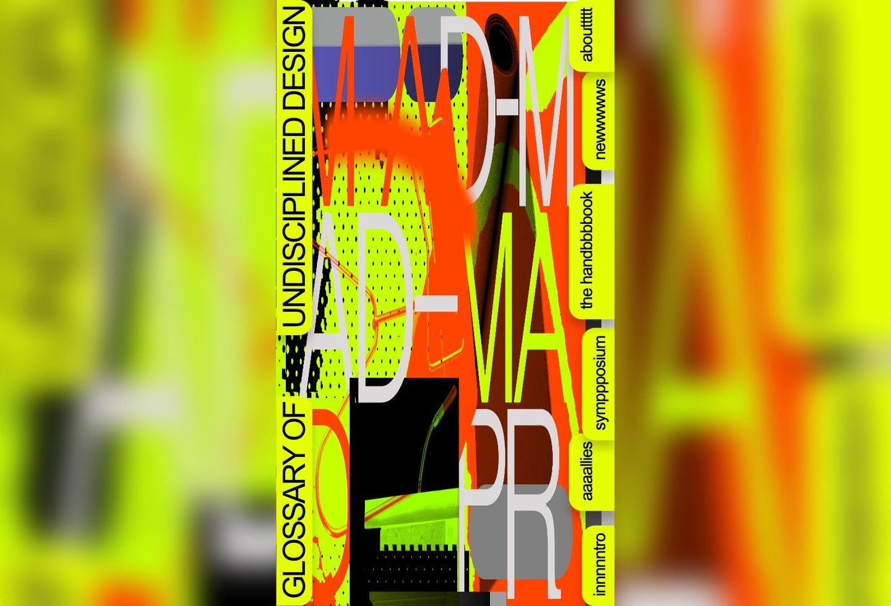
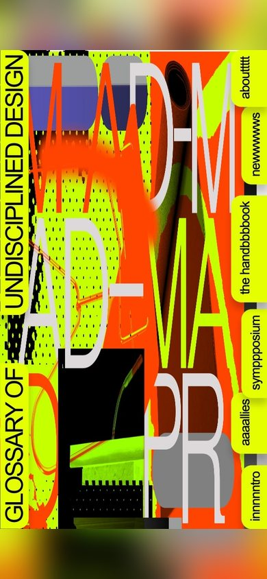

# Glossary of Undisciplined Design Inspired Design System

[DESIGN.md](./DESIGN.md) extracted from the public [Glossary of Undisciplined Design](https://a-z.undisciplined.info) website, cross-referenced with [loadmo.re](https://loadmo.re/posts/glossary-of-undisciplined-design). This is not the official design system. The goal is to give an AI agent enough grounded design language to recreate the feel without flattening it into generic SaaS UI.

## Files

| File | Description |
|------|-------------|
| DESIGN.md | Full design-system reference with separate web/mobile guidance |
| preview.html | Light preview page generated from the extracted tokens |
| preview-dark.html | Dark preview page generated from the extracted tokens |
| meta.json | Source metadata, capture checklist, extracted tokens |
| screenshots/desktop.jpg | Live or archival desktop viewport capture |
| screenshots/mobile.jpg | Live or archival mobile viewport capture |

## Source Notes

- Tags: arts&culture, glitches
- Credits: Anja Kaiser, Rebecca Stephany
- Added to loadmo.re: unknown
- Capture status: failed
- Archival fallback: yes

## Preview

### Web

### Mobile

