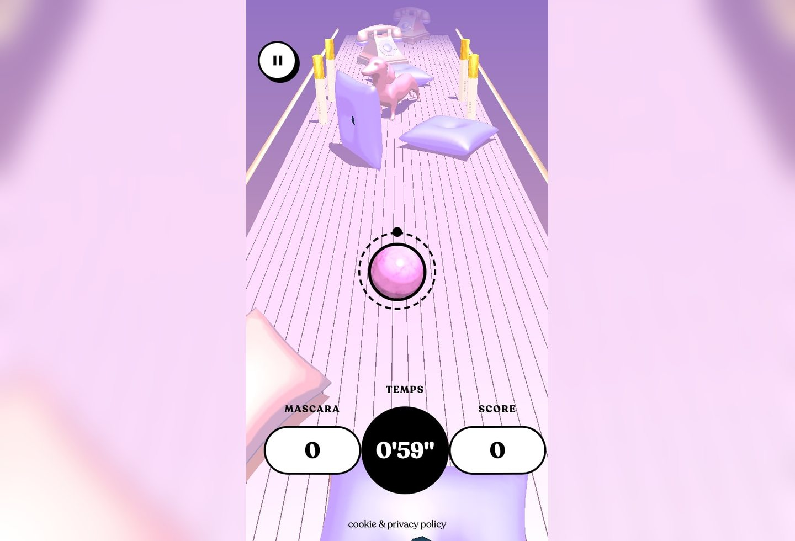
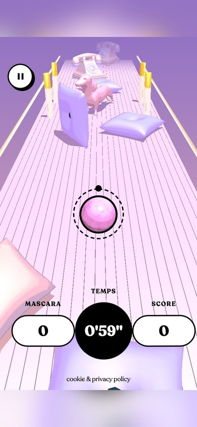

# Gucci Mascara Hunt Inspired Design System

[DESIGN.md](./DESIGN.md) extracted from the public [Gucci Mascara Hunt](https://guccimascarahunt.gucci.com) website, cross-referenced with [loadmo.re](https://loadmo.re/posts/gucci-mascara-hunt). This is not the official design system. The goal is to give an AI agent enough grounded design language to recreate the feel without flattening it into generic SaaS UI.

## Files

| File | Description |
|------|-------------|
| DESIGN.md | Full design-system reference with web/mobile guidance plus mechanics and implementation notes |
| preview.html | Light preview page generated from the extracted tokens |
| preview-dark.html | Dark preview page generated from the extracted tokens |
| meta.json | Source metadata, capture checklist, extracted tokens, inferred mechanics, and implementation prompt |
| screenshots/desktop.jpg | Live or archival desktop viewport capture |
| screenshots/mobile.jpg | Live or archival mobile viewport capture |

## Mechanics Snapshot

- World systems: Luxury Archive, Fan Shrine
- Archetype: Spatial Exhibition World
- Inputs: scroll, drag, tap, hover
- Mobile fallback: Switch to a guided tour with swipeable viewpoints and one-tap hotspot cycling instead of free camera control.

## Source Notes

- Tags: game, fashion, 3d-space
- Credits: not listed
- Added to loadmo.re: unknown
- Capture status: failed
- Capture mode: archival-fallback
- Archival fallback: yes

## Preview

### Web

### Mobile

