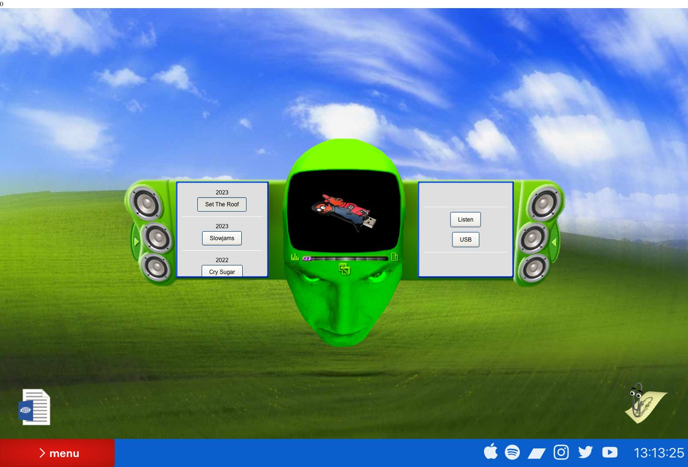
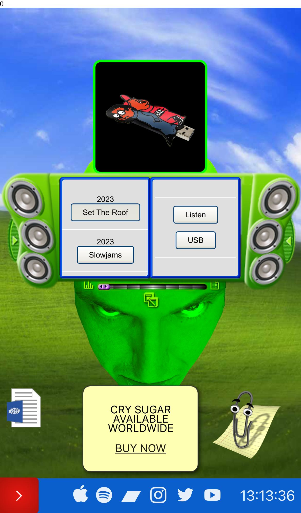

# Hudson Mohawke Inspired Design System

[DESIGN.md](./DESIGN.md) extracted from the public [Hudson Mohawke](http://www.hudsonmohawke.com/) website, cross-referenced with [loadmo.re](https://loadmo.re/posts/hudson-mohawke). This is not the official design system. The goal is to give an AI agent enough grounded design language to recreate the feel without flattening it into generic SaaS UI.

## Files

| File | Description |
|------|-------------|
| DESIGN.md | Full design-system reference with web/mobile guidance plus mechanics and implementation notes |
| preview.html | Light preview page generated from the extracted tokens |
| preview-dark.html | Dark preview page generated from the extracted tokens |
| meta.json | Source metadata, capture checklist, extracted tokens, inferred mechanics, and implementation prompt |
| screenshots/desktop.jpg | Live or archival desktop viewport capture |
| screenshots/mobile.jpg | Live or archival mobile viewport capture |

## Mechanics Snapshot

- World systems: Cozy Desktop, Club Instrument
- Archetype: Desktop Shell World
- Inputs: drag, tap, click
- Mobile fallback: Translate the window system into a card stack, bottom drawer, or tabbed shell while preserving the desktop fiction in the chrome.

## Source Notes

- Tags: net.art, music, sound-design
- Credits: DXR Zone
- Added to loadmo.re: unknown
- Capture status: ok
- Capture mode: live
- Archival fallback: no

## Preview

### Web

### Mobile

