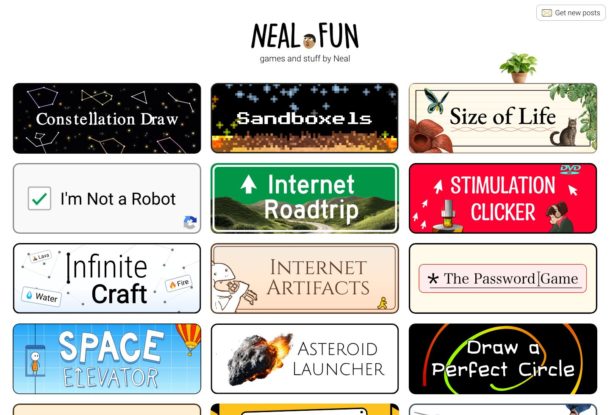
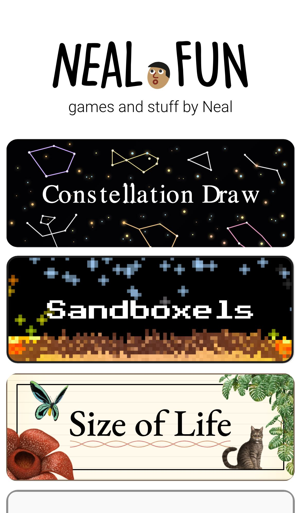

# Neal Fun Inspired Design System

[DESIGN.md](./DESIGN.md) extracted from the public [Neal Fun](https://neal.fun/) website, cross-referenced with [manual curation](https://neal.fun/). This is not the official design system. The goal is to give an AI agent enough grounded design language to recreate the feel without flattening it into generic SaaS UI.

## Files

| File | Description |
|------|-------------|
| DESIGN.md | Full design-system reference with web/mobile guidance plus mechanics and implementation notes |
| preview.html | Light preview page generated from the extracted tokens |
| preview-dark.html | Dark preview page generated from the extracted tokens |
| meta.json | Source metadata, capture checklist, extracted tokens, inferred mechanics, and implementation prompt |
| screenshots/desktop.jpg | Live or archival desktop viewport capture |
| screenshots/mobile.jpg | Live or archival mobile viewport capture |

## Mechanics Snapshot

- World systems: Playable Poster, Collage Core
- Archetype: Toy Loop Microgame
- Inputs: tap, drag
- Mobile fallback: Keep only tap and drag; remove precision mechanics, shorten the loop, and enlarge hit targets.

## Source Notes

- Tags: educational, playful, game
- Credits: Neal Agarwal
- Added to loadmo.re: Manual seed
- Capture status: ok
- Capture mode: live
- Archival fallback: no

## Preview

### Web

### Mobile

