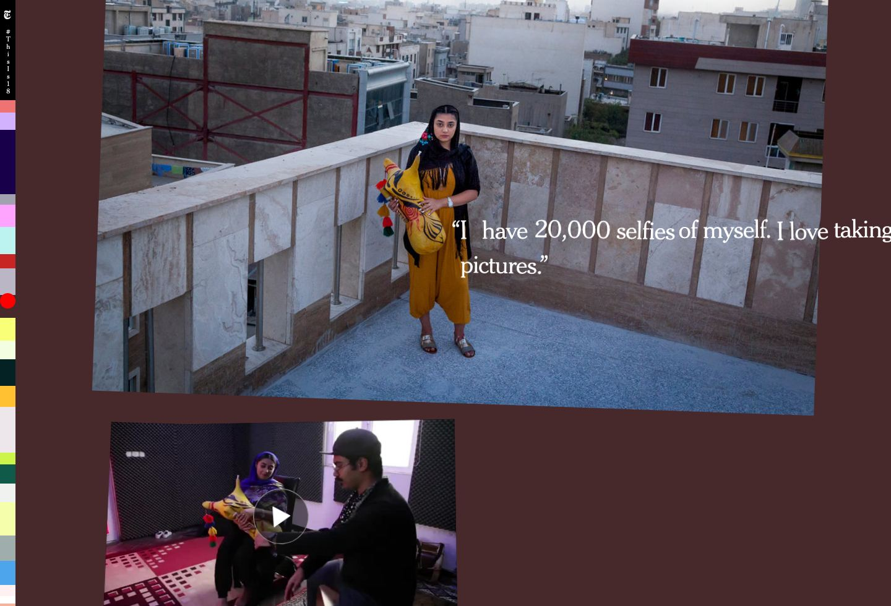
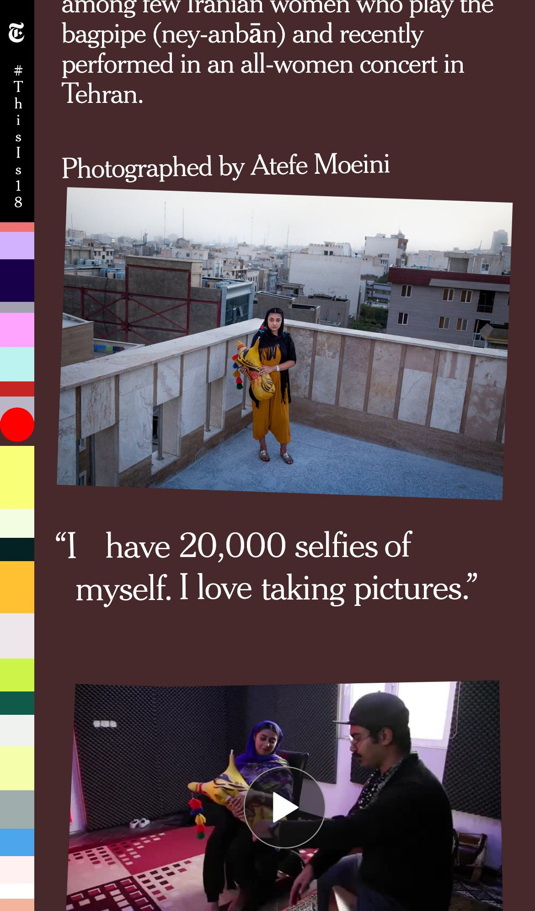

# New York Times - This is 18 around the world Inspired Design System

[DESIGN.md](./DESIGN.md) extracted from the public [New York Times - This is 18 around the world](https://www.nytimes.com/interactive/2018/10/11/style/this-is-18.html) website, cross-referenced with [loadmo.re](https://loadmo.re/posts/new-york-times-this-is-18-around-the-world). This is not the official design system. The goal is to give an AI agent enough grounded design language to recreate the feel without flattening it into generic SaaS UI.

## Files

| File | Description |
|------|-------------|
| DESIGN.md | Full design-system reference with web/mobile guidance plus mechanics and implementation notes |
| preview.html | Light preview page generated from the extracted tokens |
| preview-dark.html | Dark preview page generated from the extracted tokens |
| meta.json | Source metadata, capture checklist, extracted tokens, inferred mechanics, and implementation prompt |
| screenshots/desktop.jpg | Live or archival desktop viewport capture |
| screenshots/mobile.jpg | Live or archival mobile viewport capture |

## Mechanics Snapshot

- World systems: Collage Core, Playable Poster
- Archetype: Collage Field
- Inputs: scroll, hover, tap
- Mobile fallback: Flatten the field into a guided scavenger feed or chapter stack while preserving overlap, stickers, and hyperlink energy.

## Source Notes

- Tags: online-magazine, playful
- Credits: Bureau Borsche
- Added to loadmo.re: unknown
- Capture status: ok
- Capture mode: live
- Archival fallback: no

## Preview

### Web

### Mobile

