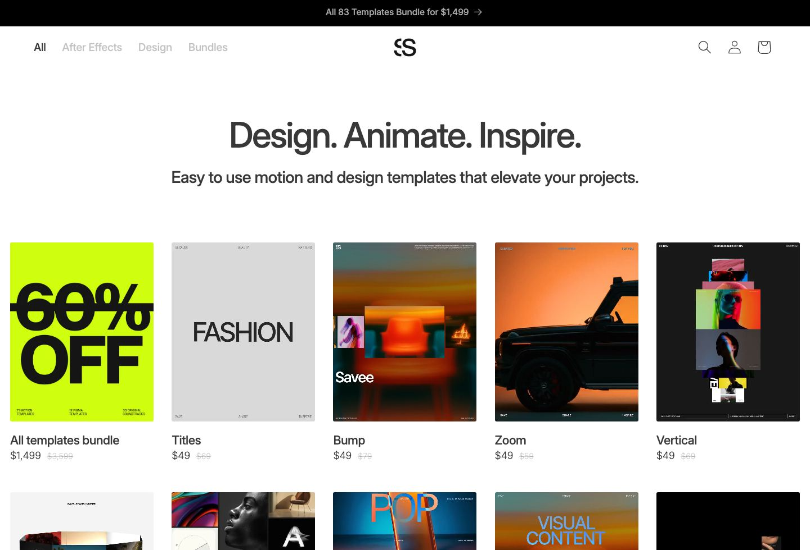
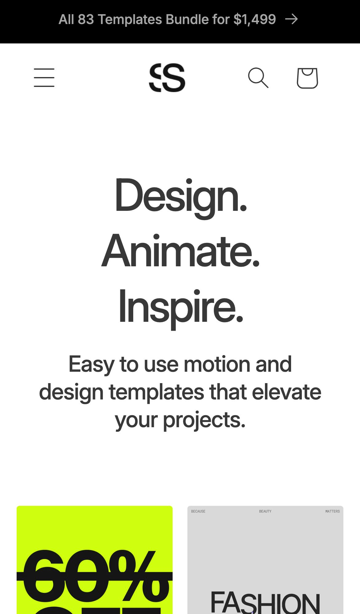

# Savee Marketplace Inspired Design System

[DESIGN.md](./DESIGN.md) extracted from the public [Savee Marketplace](https://marketplace.savee.com/) website, cross-referenced with [manual curation](https://marketplace.savee.com/). This is not the official design system. The goal is to give an AI agent enough grounded design language to recreate the feel without flattening it into generic SaaS UI.

## Files

| File | Description |
|------|-------------|
| DESIGN.md | Full design-system reference with web/mobile guidance plus mechanics and implementation notes |
| preview.html | Light preview page generated from the extracted tokens |
| preview-dark.html | Dark preview page generated from the extracted tokens |
| meta.json | Source metadata, capture checklist, extracted tokens, inferred mechanics, and implementation prompt |
| screenshots/desktop.jpg | Live or archival desktop viewport capture |
| screenshots/mobile.jpg | Live or archival mobile viewport capture |

## Mechanics Snapshot

- World systems: Playable Poster, Luxury Archive
- Archetype: Playable Poster
- Inputs: scroll, tap, hover
- Mobile fallback: Split the poster into two to four scenes, preserve one hero interaction, and drop hover-only secondary behavior.

## Source Notes

- Tags: graphic-design, animation, e-commerce, typography
- Credits: Savee
- Added to loadmo.re: Manual seed
- Capture status: ok
- Capture mode: live
- Archival fallback: no

## Preview

### Web

### Mobile

