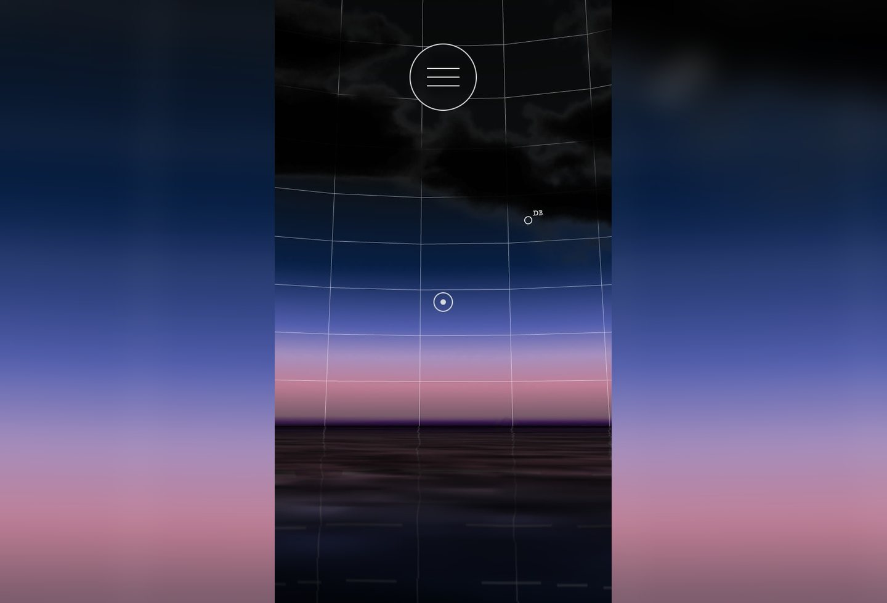
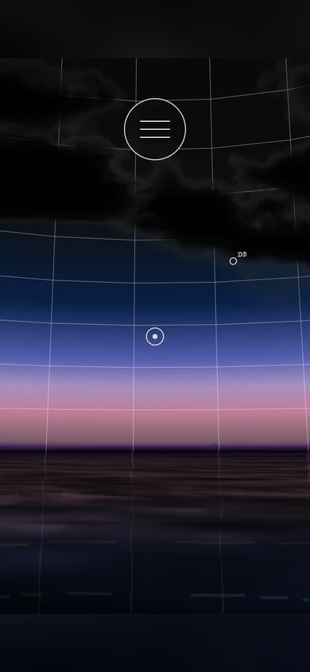

# Scrolling the Arcane Inspired Design System

[DESIGN.md](./DESIGN.md) extracted from the public [Scrolling the Arcane](https://scrollingthearcane.com/) website, cross-referenced with [loadmo.re](https://loadmo.re/posts/scrolling-the-arcane). This is not the official design system. The goal is to give an AI agent enough grounded design language to recreate the feel without flattening it into generic SaaS UI.

## Files

| File | Description |
|------|-------------|
| DESIGN.md | Full design-system reference with web/mobile guidance plus mechanics and implementation notes |
| preview.html | Light preview page generated from the extracted tokens |
| preview-dark.html | Dark preview page generated from the extracted tokens |
| meta.json | Source metadata, capture checklist, extracted tokens, inferred mechanics, and implementation prompt |
| screenshots/desktop.jpg | Live or archival desktop viewport capture |
| screenshots/mobile.jpg | Live or archival mobile viewport capture |

## Mechanics Snapshot

- World systems: Club Instrument, Collage Core
- Archetype: Scroll Scrub Instrument
- Inputs: scroll, tap
- Mobile fallback: Replace long scrub zones with a horizontal slider or stepped scenes while keeping audio opt-in.

## Source Notes

- Tags: 3d-space, portfolio
- Credits: Max Ryan
- Added to loadmo.re: unknown
- Capture status: failed
- Capture mode: archival-fallback
- Archival fallback: yes

## Preview

### Web

### Mobile

