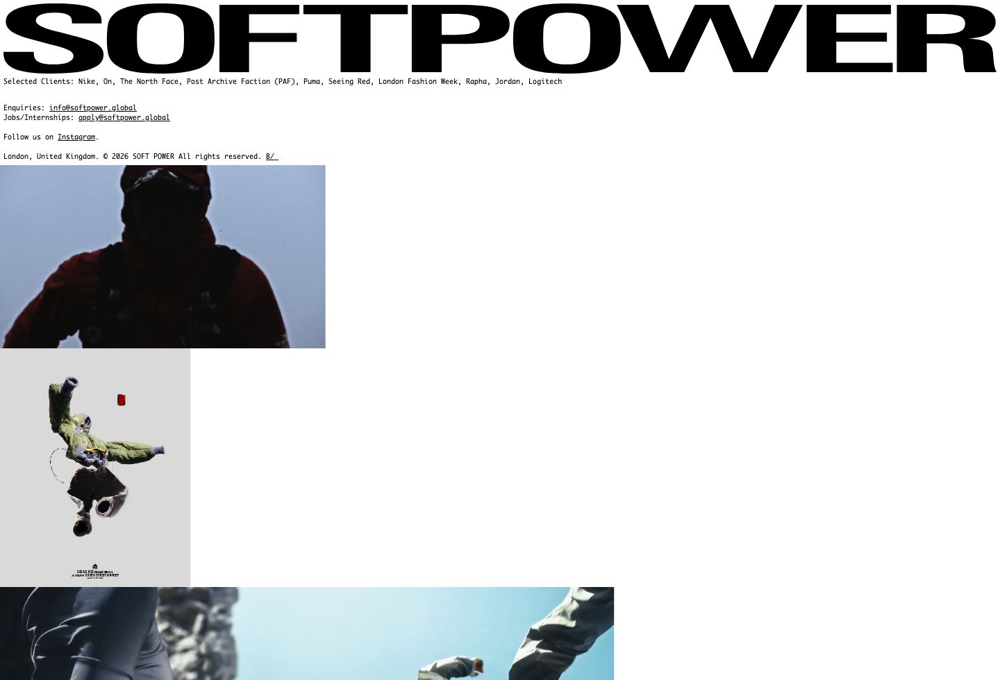
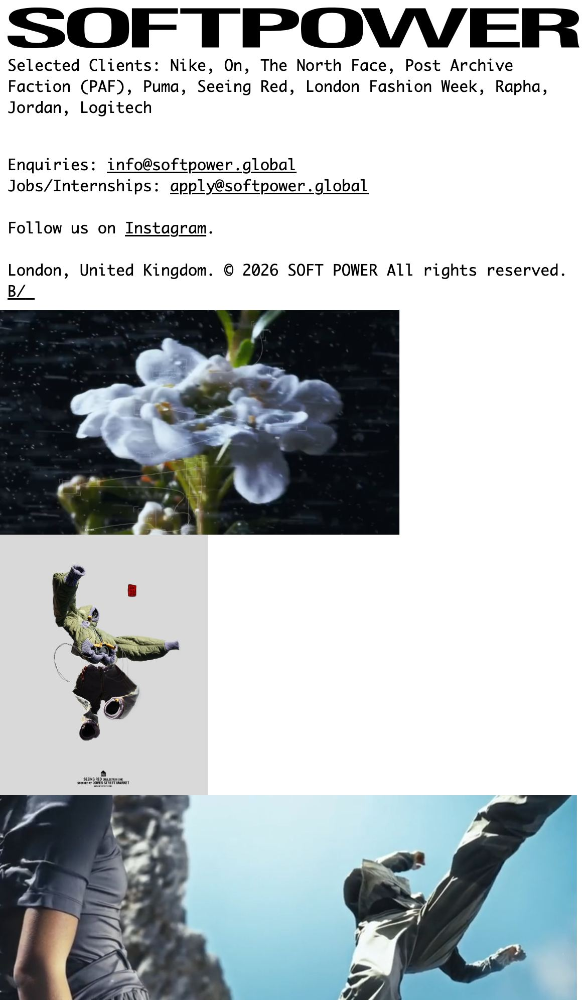

# Soft Power Inspired Design System

[DESIGN.md](./DESIGN.md) extracted from the public [Soft Power](https://softpower.xyz) website, cross-referenced with [loadmo.re](https://loadmo.re/posts/soft-power). This is not the official design system. The goal is to give an AI agent enough grounded design language to recreate the feel without flattening it into generic SaaS UI.

## Files

| File | Description |
|------|-------------|
| DESIGN.md | Full design-system reference with web/mobile guidance plus mechanics and implementation notes |
| preview.html | Light preview page generated from the extracted tokens |
| preview-dark.html | Dark preview page generated from the extracted tokens |
| meta.json | Source metadata, capture checklist, extracted tokens, inferred mechanics, and implementation prompt |
| screenshots/desktop.jpg | Live or archival desktop viewport capture |
| screenshots/mobile.jpg | Live or archival mobile viewport capture |

## Mechanics Snapshot

- World systems: Collage Core, Fan Shrine
- Archetype: Portfolio Artifact
- Inputs: scroll, tap
- Mobile fallback: Keep the asymmetry in rhythm and type, but simplify the layout into a single authored column with strong anchors.

## Source Notes

- Tags: portfolio, glitches
- Credits: Soft Power
- Added to loadmo.re: unknown
- Capture status: ok
- Capture mode: live
- Archival fallback: no

## Preview

### Web

### Mobile

