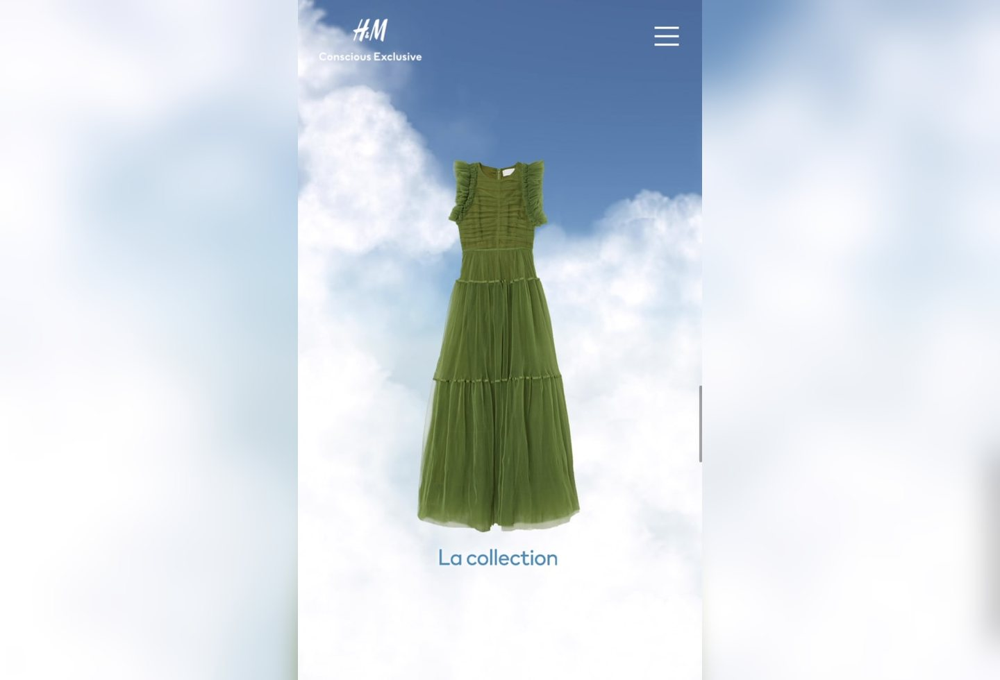
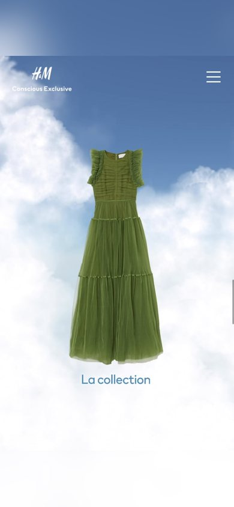

# Wear The Waste by H&M Inspired Design System

[DESIGN.md](./DESIGN.md) extracted from the public [Wear The Waste by H&M](https://wearthewaste.com/) website, cross-referenced with [loadmo.re](https://loadmo.re/posts/wear-the-waste-by-h-m). This is not the official design system. The goal is to give an AI agent enough grounded design language to recreate the feel without flattening it into generic SaaS UI.

## Files

| File | Description |
|------|-------------|
| DESIGN.md | Full design-system reference with web/mobile guidance plus mechanics and implementation notes |
| preview.html | Light preview page generated from the extracted tokens |
| preview-dark.html | Dark preview page generated from the extracted tokens |
| meta.json | Source metadata, capture checklist, extracted tokens, inferred mechanics, and implementation prompt |
| screenshots/desktop.jpg | Live or archival desktop viewport capture |
| screenshots/mobile.jpg | Live or archival mobile viewport capture |

## Mechanics Snapshot

- World systems: Playable Poster, Fan Shrine
- Archetype: Playable Poster
- Inputs: scroll, tap, hover
- Mobile fallback: Split the poster into two to four scenes, preserve one hero interaction, and drop hover-only secondary behavior.

## Source Notes

- Tags: fashion
- Credits: Julian Garnier
- Added to loadmo.re: unknown
- Capture status: failed
- Capture mode: archival-fallback
- Archival fallback: yes

## Preview

### Web

### Mobile

