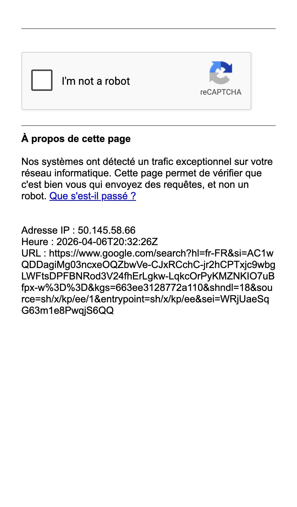

# Westminster Kennel Club Inspired Design System

[DESIGN.md](./DESIGN.md) extracted from the public [Westminster Kennel Club](https://www.google.com/search?hl=fr-FR&si=AC1wQDDagiMg03ncxeOQZbwVe-CJxRCchC-jr2hCPTxjc9wbgLWFtsDPFBNRod3V24fhErLgkw-LqkcOrPyKMZNKIO7uBfpx-w%3D%3D&kgs=663ee3128772a110&shndl=18&source=sh/x/kp/ee/1&entrypoint=sh/x/kp/ee) website, cross-referenced with [loadmo.re](https://loadmo.re/posts/westminster-kennel-club). This is not the official design system. The goal is to give an AI agent enough grounded design language to recreate the feel without flattening it into generic SaaS UI.

## Files

| File | Description |
|------|-------------|
| DESIGN.md | Full design-system reference with web/mobile guidance plus mechanics and implementation notes |
| preview.html | Light preview page generated from the extracted tokens |
| preview-dark.html | Dark preview page generated from the extracted tokens |
| meta.json | Source metadata, capture checklist, extracted tokens, inferred mechanics, and implementation prompt |
| screenshots/desktop.jpg | Live or archival desktop viewport capture |
| screenshots/mobile.jpg | Live or archival mobile viewport capture |

## Mechanics Snapshot

- World systems: Luxury Archive, Playable Poster
- Archetype: Editorial Archive Index
- Inputs: scroll, tap, filter
- Mobile fallback: Keep a single-column feed, bottom-sheet filters, a persistent current-section pill, and inline detail expansion.

## Source Notes

- Tags: playful, tactile
- Credits: not listed
- Added to loadmo.re: unknown
- Capture status: ok
- Capture mode: live
- Archival fallback: no

## Preview

### Web

### Mobile

