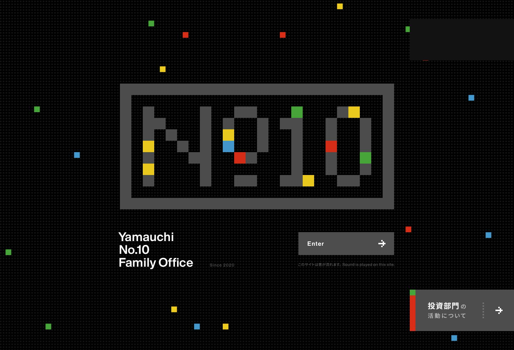
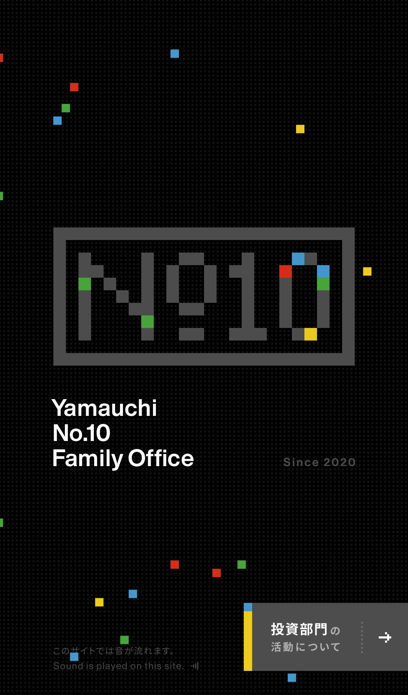

# Yamauchi No.10 Family Office Inspired Design System

[DESIGN.md](./DESIGN.md) extracted from the public [Yamauchi No.10 Family Office](https://y-n10.com) website, cross-referenced with [loadmo.re](https://loadmo.re/posts/yamauchi-no-10-family-office). This is not the official design system. The goal is to give an AI agent enough grounded design language to recreate the feel without flattening it into generic SaaS UI.

## Files

| File | Description |
|------|-------------|
| DESIGN.md | Full design-system reference with web/mobile guidance plus mechanics and implementation notes |
| preview.html | Light preview page generated from the extracted tokens |
| preview-dark.html | Dark preview page generated from the extracted tokens |
| meta.json | Source metadata, capture checklist, extracted tokens, inferred mechanics, and implementation prompt |
| screenshots/desktop.jpg | Live or archival desktop viewport capture |
| screenshots/mobile.jpg | Live or archival mobile viewport capture |

## Mechanics Snapshot

- World systems: Club Instrument
- Archetype: Club Instrument
- Inputs: tap, drag, press
- Mobile fallback: Collapse to one active control strip, one focal stage, and tap-to-trigger presets instead of a dense multi-panel control surface.

## Source Notes

- Tags: sound-design, game, 3d-space
- Credits: mount inc., 米道昌弘, 梅津岳城
- Added to loadmo.re: unknown
- Capture status: ok
- Capture mode: live
- Archival fallback: no

## Preview

### Web

### Mobile

